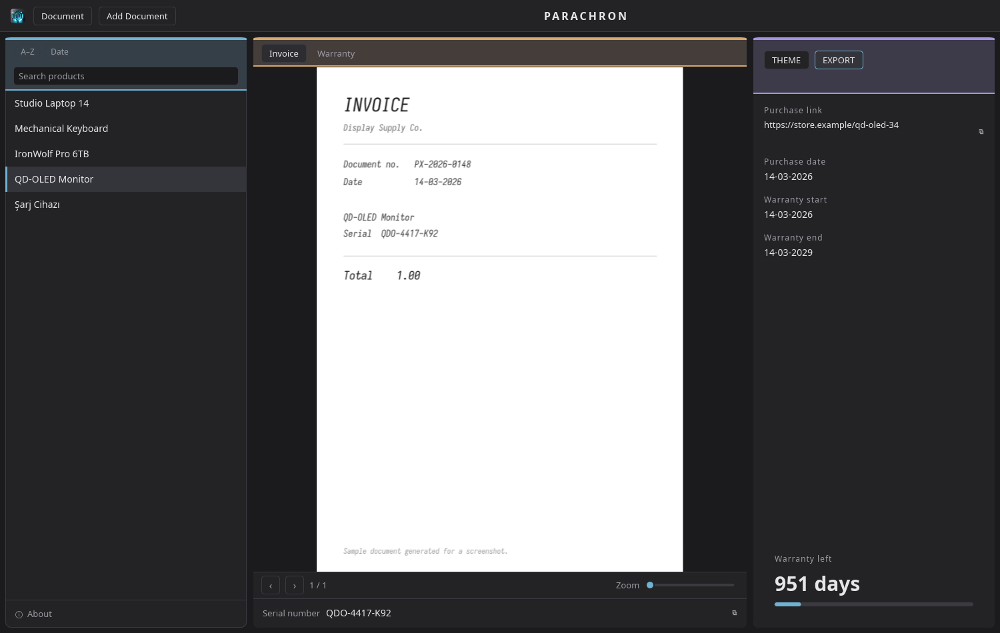
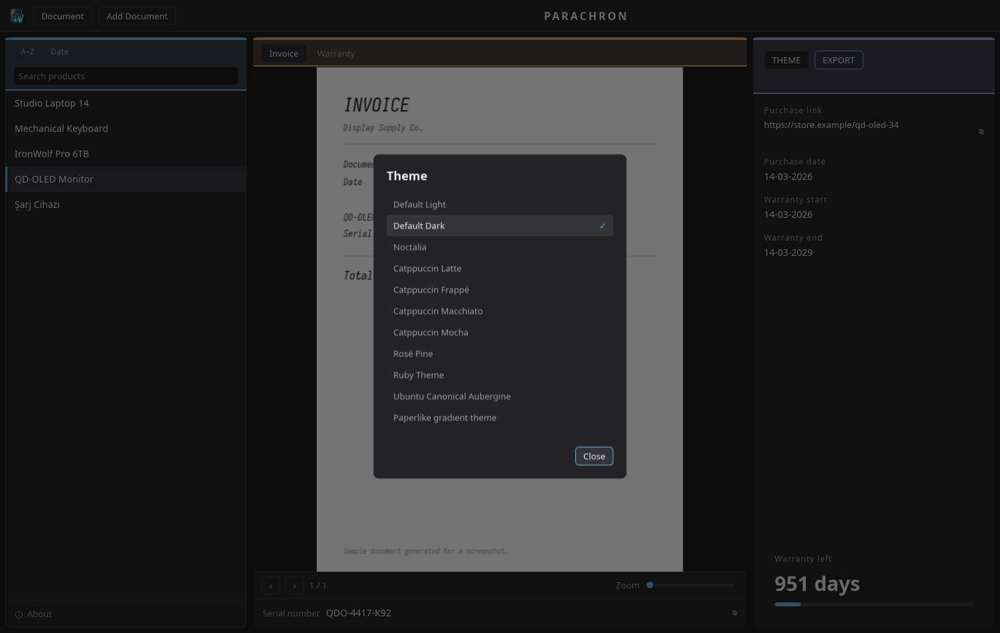

<p align="center" width="100%">
    
</p>


<h1 align="center">PARACHRON</h1>
<p align="center"><strong>A desktop vault for your purchases.</strong></p>

<p align="center">
  <a href="https://github.com/sudo-megas/PARACHRON/actions/workflows/ci.yml"></a>
</p>

<p align="center">
  
  
  

</p>

<p align="center">
  
  
  
</p>


---

## Description

Parachron keeps every product's invoices, warranty PDFs, serial number and purchase details in one place, and counts down the warranty in days.

Everything lives in plain folders on your own disk — one folder per product, human-readable, easy to back up. No account, no cloud, no telemetry.



---

## Dependencies

**To run a packaged release** — no PDF engine to install. MuPDF is built into
the binary, which is the part people usually have to go and find. The Linux
packages do depend on the graphics, font and D-Bus libraries your desktop is
already built on; your package manager pulls them in for you. The Windows `.exe`
carries everything of its own, and needs Microsoft's Visual C++ Redistributable,
which most machines already have — see the Windows section below.

**To build from source** you need:

- `rust` and `cargo` (stable)
- `clang` — the PDF engine generates its bindings with it
- a C toolchain: `gcc`/`g++`, `make`, `python`
- `fontconfig`

<details>
<summary>Per distribution</summary>

```bash
# Arch / CachyOS
sudo pacman -S --needed rust clang gcc make python fontconfig

# Debian / Ubuntu
sudo apt install build-essential clang python3 libfontconfig1-dev
# plus rustup, from https://rustup.rs
```

</details>

---

## Installation

> **1.0.1 is out.** All three packaged downloads — `.pkg.tar.zst`, `.deb` and `.exe` — are on the [Releases](https://github.com/sudo-megas/PARACHRON/releases/latest) page, built by this repository's own public workflow.

### Build from source

Works on every platform Parachron supports.

```bash
git clone https://github.com/sudo-megas/PARACHRON.git
cd PARACHRON
cargo build --release
```

The binary lands at `target/release/parachron`. Run it from there, or copy it somewhere on your `PATH`:

```bash
sudo install -Dm755 target/release/parachron /usr/bin/parachron
```

The first build takes a few minutes — it compiles MuPDF from source. Later builds are quick.

### Arch Linux / CachyOS

**From the repository's PKGBUILD**

```bash
git clone https://github.com/sudo-megas/PARACHRON.git
cd PARACHRON/packaging
makepkg -si
```

**From a release**

Download `parachron-*.pkg.tar.zst` from [Releases](https://github.com/sudo-megas/PARACHRON/releases/latest), then:

```bash
sudo pacman -U parachron-*.pkg.tar.zst
```

### Debian / Ubuntu

Download `parachron_*.deb` from [Releases](https://github.com/sudo-megas/PARACHRON/releases/latest), then:

```bash
sudo apt install ./parachron_*.deb
```

Parachron will appear in your applications menu.

### Windows

Download `parachron.exe` from [Releases](https://github.com/sudo-megas/PARACHRON/releases/latest) and run it. It is a single executable — nothing to unpack, and no installer.

The Windows build is produced by GitHub Actions from this repository, so its build log is public. It is not code-signed, so Windows may show a SmartScreen warning the first time; choose **More info → Run anyway**.

**One thing it does need.** Parachron uses Microsoft's Visual C++ Redistributable, which Windows itself does not include. Most machines already have it — it arrives with Office, with games, and with a great many installers — so on a typical PC there is nothing to do. If yours does not have it, Parachron will not start and Windows will say which file is missing:

```
The code execution cannot proceed because VCRUNTIME140.dll was not found.
```

The fix is a small one-time download from Microsoft: [Visual C++ Redistributable for x64](https://aka.ms/vs/17/release/vc_redist.x64.exe). Install it, and Parachron will start.

<details>
<summary>If it closes immediately, or you are on a virtual machine or remote desktop</summary>

Parachron draws with your graphics driver. On a machine with no real OpenGL —
a VM, some remote-desktop sessions, a server — it will exit at once with:

```
Failed to initialize OpenGL driver: Could not locate glCreateShader symbol
```

Set one environment variable to draw in software instead, and it will start:

```
set SLINT_BACKEND=winit-software
parachron.exe
```

Everything works the same; it just uses the processor rather than the graphics
card. On an ordinary desktop you should never need this.

</details>

---

## How to use

### Product list

The left column lists everything in your vault, newest addition at the bottom. Two chips at the top reorder it — **A–Z** alphabetically, **Date** by purchase date, oldest first. Click either again to go back to the order you added things in. A folder Parachron cannot read stays in the list, marked, rather than disappearing.

### Search

The bar above the list narrows it as you type, matching **product names and serial numbers**. Accents and letter case do not matter: typing `sarj` finds `Şarj Cihazı`. Press `Esc` or click the ✕ to clear it. What you are reading stays open even if your search hides its row.

### Document viewer

The centre column shows the selected product's PDFs, one tab per file. Move through pages with `‹` and `›`, and use the zoom slider to get closer — at `1×` the whole page always fits, whatever the window size. Under the page, a strip shows the serial number; click it to copy.

### Details panel

The right column holds the purchase link, the purchase date, the warranty start and end, and the days remaining in large type. Click the link to copy it — Parachron never opens a browser for you. An expired warranty says so instead of counting into negative numbers.

### Add document

**Document ▾ → Add Document** opens a form for a product's name, serial, purchase link and three dates, and lets you attach its PDFs. The files are copied into the vault, so the originals are yours to move or delete. **Edit Document…** reopens the same form for the selected product.

### Export

**EXPORT** builds one PDF for the selected product: a clean summary page — name, serial, dates, days left, purchase link — followed by every one of that product's documents. It is the thing to email to a shop. Anything that could not be included is named on the summary page itself.

### Themes

**THEME** offers eleven built-in colour schemes, light and dark, including Catppuccin, Rosé Pine and a paper-like light theme. The choice applies instantly and is remembered.



### About

At the foot of the left column. Shows the version, the release date, where the source lives, and the full licence text. Parachron is also available in **Turkish** — switch under **Document ▾ → Language**.

---

## Where your data lives

```
~/.local/share/parachron/          # Linux
├── products/
│   └── qd-oled-monitor/
│       ├── product.toml      # name, serial, link, dates
│       ├── invoice.pdf
│       └── warranty.pdf
└── config.toml               # theme, language, sort order, window size
```

On **Windows** the same folder is:

```
%APPDATA%\parachron\data\
```

which is usually `C:\Users\<you>\AppData\Roaming\parachron\data\`. Paste that
into Explorer's address bar to open it.

Plain text and plain folders. Copy the directory anywhere to back it up, and Parachron will read it again as it is.

### Keeping documents on another disk

Invoices add up, and the folder above sits on whichever disk your home directory
does. **Document ▾ → Vault location…** moves `products/` somewhere else — an
external drive, a second SSD — and tells you how many files and megabytes are
about to move before anything does.

`config.toml` stays where it is. It holds the setting that says where your
documents went, so it cannot travel with them. After a move you have two places
to back up rather than one, and the documents are the half that matters. The
**About** pane always names the current location, so you never have to remember
it.

If Parachron cannot find a vault you moved — an external drive that is not
plugged in, say — it says so and shows you the path it looked for. It will not
quietly start a new empty one somewhere else.

---

## Licence

Parachron is free and open source under the **GNU AGPL-3.0**. You can use it, study it, change it and share it. If you distribute a modified version — including running it as a network service — the source of your version has to stay open under the same licence.

The full text is in [LICENSE](LICENSE), and the app shows it under **About → Read the full license**.
